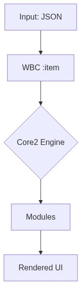
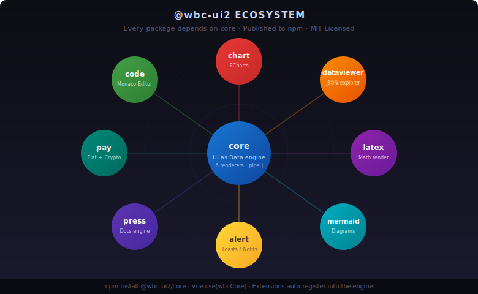

<p align="center">
  
</p>

<p align="center">
  <strong>UI as Data. Vue 2. Unlimited.</strong><br/>
  <em>Define components as JSON. Let the engine render. Ship complex UIs in minutes, not weeks.</em>
</p>

<p align="center">
<a href="https://www.npmjs.com/package/@wbc-ui2/core"></a>
<a href="https://www.npmjs.com/package/@wbc-ui2/core?activeTab=versions"></a>
<a href="https://github.com/wbc-ui2/core/blob/main/LICENSE"></a>
<a href="https://vuejs.org"></a>
</p>

<p align="center">
  <a href="https://wbcore2.wbc-ui.com">📘 Docs</a> ·
  <a href="https://github.com/wbc-ui2/core">🐙 GitHub</a> ·
  <a href="https://demo.wbc-ui.com/lab">▶️ Playground</a> ·
  <a href="https://wbc-ui.com">💎 Pro</a>
</p>

<p align="center">
  
</p>

---

## Why?

**@wbc-ui2/core** replaces the entire HTML/CSS/JS template stack with a single `<WBC>` tag driven by data.

### Write 10× less code

```javascript
// Before: 80 lines of <template>, <script>, methods, computed, v-if, v-for
// After: one line. One component.
<WBC :item="dynamicUIConfig" />
```

The engine understands **files**, **URLs**, **Markdown**, **code**, and **rich media** natively — no wrapper components, no special handling. Pipe `|` syntax gives you styling, linking, and type-override in a single string.

### Markdown becomes interactive

```html
<WBC :item="'./landing.md'" />
<!-- Renders a full markdown page with TOC, syntax-highlighted code blocks,
     anchor links, and copy buttons. The markdown IS the UI. -->
```

### Files and URLs as first-class citizens

```javascript
<WBC :item="'./chart-data.json'" />          // JSON → rendered
<WBC :item="'./hero.png|rounded elevation-4'" /> // image with Vuetify classes
<WBC :item="'./code-sample.py'" />           // Python → syntax-colored block
<WBC :item="'https://api.example.com/data'" /> // fetch → parse → render
<WBC :item="'./slides.pdf'" />               // PDF viewer
<WBC :item="'https://youtu.be/dQw4w9WgXcQ'" />// YouTube embed
```

### Replace HTML · CSS · JS with JSON

```javascript
// No <div>. No class="" strings. No event handlers in templates.
// Everything is an object. Everything is reactive.
{
  comp: 'VCard',
  options: {
    html: (ctx) => ctx.data.intro,              // dynamic HTML
    class: (ctx) => ctx.dark ? 'dark-card' : null, // conditional CSS
    on: { click: (ctx) => ctx.toggle('expanded') }, // reactive events
    props: { elevation: 4 }
  },
  items: [
    './logo.png|ma-auto',                        // file with Vuetify classes
    { comp: 'VBtn', options: { html: '[[ CTA ]]' } } // WBHtml markup inside
  ]
}
```

> **One language. One component. One `<WBC>` tag.** No template files. No CSS files. No `<style scoped>`. Everything is data.

---

## What is @wbc-ui2/core?

A **Vue 2.7+ plugin** that implements the **"UI as Data"** paradigm. You feed it a JSON object — it recursively builds a live, reactive Vuetify/Bootstrap UI.

| Component | Role |
|---|---|
| `<WBC :item="...">` | Polymorphic rendering engine — dispatches to 6 renderers based on item type |
| `renderString` | Inline strings with pipe `|` syntax: `"text|class|link|parsedAs"` |
| `renderObject` | Component descriptors: `{ comp: 'VBtn', options: { ... } }` |
| `renderArray` | Lists/grids with inheritance, disposition, and virtual scrolling |
| `renderFile` | Images, videos, PDFs, code files |
| `renderFunction` | Lazy-evaluated render functions |
| `renderPrimitive` | Numbers, booleans, dates |

**Who's it for?** Solutions architects, full-stack devs, low-code platform builders — anyone who needs to ship complex, data-driven UIs without drowning in templates.

---

## Usage Examples

### Level 1 — Hello World
```html
<WBC :item="'Welcome to @wbc-ui2/core|text-h3 primary--text'" />
```
→ Renders `<h3 class="primary--text">Welcome to @wbc-ui2/core</h3>`. The pipe `|` separates content from styling — ½ second of typing.


### Level 2 — A full card
```html
<WBC :item="{
  comp: 'VCard',
  options: {
    props: { elevation: 4, outlined: true },
    html: '<h2>{{ title }}</h2><p>{{ body }}</p><v-btn @click=\"doAction\">Go</v-btn>',
    class: 'ma-4',
    on: { click: (ctx) => ctx.emit('selected', ctx.data) }
  }
}" />
```

### Level 3 — Reactive, data-driven, multilingual
```javascript
// This object could come from an API, a CMS, or a user-built form
const pageDefinition = {
  dive: true,                              // enable reactive mode
  comp: (ctx) => ctx.lg === 'ar'           // component changes by language
    ? 'VSheet' : 'VContainer',
  options: {
    html: (ctx) => ctx.data.intro[ctx.lg], // pick localized content
    class: (ctx) => ctx.wbcTier === 'pro'  // tier-gated styling
      ? 'gradient-hero' : 'flat-hero'
  },
  items: [
    { comp: 'VAvatar', options: { props: { src: '/logo.png', size: 64 } } },
    { comp: 'VBtn', options: { html: '{{ CTA }}', on: { click: 'goPricing' } } }
  ]
};
// One <WBC :item="pageDefinition" /> renders the entire page.
```

---

## 🚀 Try it in 30 seconds

```bash
# Starter template (coming soon — repo in development)
npx degit wbc-ui2/starter my-app && cd my-app && npm install && npm run dev
```

> While the starter template is being finalized, the easiest way to explore the engine is the live demo: **[demo.wbc-ui.com](https://www.demo.wbc-ui.com/lab)** — a multi-page app built from JSON, with live source visible alongside each example.

---

## Installation

### Prerequisites

- **Node.js** ≥ 18 (the engine declares this; older versions may work but are not tested)
- **Vue 2.7.x** (the library targets Vue 2 specifically; Vue 3 support tracked separately as `@wbc-ui3/core`)
- A bundler that understands ESM exports: Vite (recommended), Webpack 5, or Vue CLI 5

### npm (recommended)

```bash
npm install @wbc-ui2/core

# Peer dependencies — install once per project
npm install vue@^2.7.16 vuetify@^2.7.2 vuex@^3.6.2 vue-router@^3
```

### Yarn / pnpm

```bash
# Yarn
yarn add @wbc-ui2/core
yarn add vue@^2.7.16 vuetify@^2.7.2 vuex@^3.6.2 vue-router@^3

# pnpm
pnpm add @wbc-ui2/core
pnpm add vue@^2.7.16 vuetify@^2.7.2 vuex@^3.6.2 vue-router@^3
```

> The published tarball is currently tagged `next` (see `publishConfig.tag` in `package.json`). To install the latest release explicitly: `npm install @wbc-ui2/core@next`.

### Vite project setup

```javascript
// vite.config.js
import { wbcVitePlugin } from '@wbc-ui2/core/vite-plugin';
export default defineConfig({
  plugins: [vue(), ...wbcVitePlugin()]  // ← auto-aliases, raw loaders, require.context
});
```

### Webpack project setup

For Webpack 5 / Vue CLI 5 projects:

```javascript
// webpack.config.js or vue.config.js
const wbcWebpack = require('@wbc-ui2/core/wbc.webpack.js');
// See the plugin's exports for the available configuration API.
```

### Vue 2 plugin registration

```javascript
// main.js
import Vue from 'vue';
import wbcCore from '@wbc-ui2/core';

Vue.use(wbcCore);
// That's it. Vuetify, Vuex, BootstrapVue, MarkdownIt are auto-installed.
// Use <WBC :item="..."> anywhere in your app.
```

### Named imports

```javascript
import { WBC, WBHtml, WBLink, getVuetifyInstance } from '@wbc-ui2/core';
```

### Ecosystem extensions

The core engine is intentionally small. Optional functionality lives in sibling packages — each registers itself into the core after `Vue.use(wbcCore)`:

```javascript
import Vue from 'vue';
import wbcCore   from '@wbc-ui2/core';      // Always first — extensions depend on it
import wbCode    from '@wbc-ui2/code';      // Code editor + syntax highlighting
import wbLatex   from '@wbc-ui2/latex';     // LaTeX math rendering
import wbMermaid from '@wbc-ui2/mermaid';   // Mermaid diagrams
import wbChart   from '@wbc-ui2/chart';     // ECharts data visualization

Vue.use(wbcCore);
Vue.use(wbCode);
Vue.use(wbLatex);
Vue.use(wbMermaid);
Vue.use(wbChart);
```

Other available extensions: `@wbc-ui2/alert`, `@wbc-ui2/cli`, `@wbc-ui2/dataviewer`, `@wbc-ui2/gis`, `@wbc-ui2/js`, `@wbc-ui2/office`, `@wbc-ui2/press`. See the [Ecosystem](#-ecosystem) section below for what each one adds.

### Troubleshooting common install errors

| Symptom | Cause | Fix |
|---|---|---|
| `Vue.use is not a function` | Two copies of Vue are loaded (typically: your app has Vue 2, but a dependency hoisted Vue 3) | Pin a single Vue version: add `"resolutions": { "vue": "^2.7.16" }` (yarn/pnpm) or use npm `overrides`. Then `rm -rf node_modules && reinstall`. |
| `Cannot find module '@wbc-ui2/core/vite-plugin'` | npm couldn't resolve the subpath export | Confirm `@wbc-ui2/core` ≥ `1.0.0-r01` is installed (the vite-plugin subpath was added then). Run `npm ls @wbc-ui2/core`. |
| `peer dep missing: vuetify@^2` | Vuetify wasn't installed — it's a peer dep, not a hard one | `npm install vuetify@^2.7.2` (and any other peer deps the warning names). |
| Components render but unstyled | Vuetify CSS isn't loaded | Import once in `main.js`: `import 'vuetify/dist/vuetify.min.css';` |
| `Multiple instances of Vue detected` warning | The bundler resolved Vue from two locations | In Vite: add an alias in `vite.config.js` mapping `vue` to a single absolute path. The `wbcVitePlugin()` does this automatically for the default setup. |

For a longer walkthrough with worked examples, see the documentation hub at [wbcore2.wbc-ui.com](https://wbcore2.wbc-ui.com) *(content is being migrated to match the new `@wbc-ui2` scope; some pages may still show the legacy `wbc-ui2` name during the transition)*.

---

## ⚡ The Engine Under the Hood

<p align="center">
  
</p>

<details>
<summary>Mermaid diagram (interactive fallback)</summary>
<p align="center">
  
</p>
</details>

- **6 renderers** dispatch based on JavaScript type
- **Pipe syntax** for inline styling: `Hello text-h4 primary--text /docs html`
- **`dive: true`** activates reactive mode — every property becomes a function of `(ctx)` state
- **Post-processing decorators** apply focus mode, RTL, selection overlays, and code rendering

---

## 🧭 Routing — UI as Routes

WBC doesn't only render content — any rendered block or link can become a **real, deep-linkable route**, registered on the fly and persisted across refresh. No edits to `router/index.js`.

### Self-registering routes — `options.route`

Give any item `options.route` and rendering it registers a permanent route on mount:

```javascript
<WBC :item="{
  comp: 'VCard',
  options: {
    route: 'Pricing',                          // string → /wbc/Pricing
    // or: route: { name: 'Pricing', path: '/pricing', meta: { section: 'marketing' } }
    html: ['h1__Plans', 'p__Pick a tier'],
  }
}" />
// After mount, /wbc/Pricing exists, renders this exact descriptor, and survives a refresh:
this.$router.push({ name: 'Pricing' });
```

The route **name is the unique key** — re-registering it with new content *overrides* the stored route (persisted to `localStorage` through a host-provided sink). *(The earlier `options.name` / `options.path` still work but are deprecated.)*

### Named routes from a plain string — `name__[path__]<payload>`

The 3rd pipe field of a string (or `[[ … ]]`) item is its link. Prefix it with a **route name** (and an optional path) and WBC registers a persisted route that **renders the payload through WBC**. The payload is any WBC item — a URL string, or an object/array descriptor (parsed with `strToObj`):

```html
<!-- payload = URL → rendered as  -->
<WBC item="open gallery | pa-2 | gallery__https://cdn.example.com/photo.jpg" />
<!--                              └ name ─┘  └────────── URL ──────────┘ -->

<!-- custom path -->
<WBC item="hero | pa-2 | hero__/media/hero__https://cdn.example.com/hero.jpg" />
<!--                     └name┘ └ custom path ┘ -->

<!-- payload = a WBC descriptor object → rendered as the page -->
<WBC item="open dashboard | pa-2 | dash__/dashboard__{ comp:'VCard', options:{ html:['h1__Dashboard'] } }" />

<!-- payload = an array (bracketed, or a bracket-less comma list) → rendered via renderArray -->
<WBC item="open list | pa-2 | items__['<ul>','a','b','c']" />
<WBC item="open list | pa-2 | items__'<ul>','a','b','c'" />
```

`gallery` → `/wbc/gallery`; the optional middle segment sets a custom path (`/media/hero`, `/dashboard`). Since it's just text, a **grid of media becomes a few plain strings** — each tile a routable, refresh-safe WBC page:

```html
<WBC :item="['<~div,d-flex flex-wrap>',
  'shot 1 | pa-1 | pic1__https://cdn.example.com/1.jpg',
  'shot 2 | pa-1 | pic2__https://cdn.example.com/2.jpg',
  'demo   | pa-1 | clip__https://cdn.example.com/demo.mp4',
]" />
```

For richer routes (guards, `meta`, a descriptor payload instead of a bare URL) use the object form `options.route`. Full reference: **[Links & Dynamic Routes](https://wbcore2.wbc-ui.com/advanced-routing/links-and-dynamic-routes)**.

### Every form at a glance

The `<link>` is the 3rd `|` field of a string/`[[ … ]]` item. Each row is a complete, runnable example:

| `<link>` you write | Route | Renders |
|---|---|---|
| `gallery__https://…/p.jpg` | `/wbc/gallery` | the URL as `` (video / iframe / YouTube by type) |
| `hero__/media/hero__https://…/h.mp4` | `/media/hero` | URL with a **custom path** (middle segment) |
| `card__{ comp:'VCard', options:{ html:['h1__Hi'] } }` | `/wbc/card` | the **object** descriptor as the page |
| `dash__/dash__{ comp:'VCard', options:{…} }` | `/dash` | object + custom path |
| `items__['<ul>','a','b']` | `/wbc/items` | a **bracketed array** via `renderArray` |
| `items__'<ul>','a','b'` | `/wbc/items` | a **bracket-less** comma list (same result) |
| `grid__[ '<~VRow>', [ 'u','u' ], [ 'u','u' ] ]` | `/wbc/grid` | **nested** — space the adjacent `] ]` / `[ [` (or escape `\]\]`) so WBHtml's `[[ ]]` tokenizer doesn't eat them |
| `Pricing` *(via `options.route` on a rendered item)* | `/wbc/Pricing` | the item registers **itself** on mount (object form above) |

> **Gotchas:** the payload can't contain a raw `|` (escape `\|` or use `h2__Text` shorthand); a single-key object `{a:1}` doesn't round-trip (add a 2nd key); names are a global key, so use unique names in loops.

---

## 💎 Free vs Pro

<p align="center">
  
</p>

> *"Free users can **bind** states. Pro users can **command** them."*
> *"3 hooks for builders, 7 hooks for architects."*

**Open core.** The renderer (everything you see) is free. The orchestrator + extractor (everything that makes it programmable at scale) is Pro.

| Capability bucket | Free | Pro |
|---|---|---|
| Core rendering (6 renderers, pipe `\|`, `dive: true`) | ✅ Full | ✅ Full |
| Lifecycle hooks | 3 (init0 · init · updater) | **7** (+ setup · tracker · logic · `output`) |
| `that` API surface | `data`, `update`, `emit`, `toggle*` (binary) | **+ `vm`, `data0`, `val`, `get/set`, `ref`, `el`, `watch`** + precision toggles |
| Framework access | — | `store`, `router`, `routes`, `routeParams` |
| Services | dayjs (±14d), basic storage / cookies | **Full dayjs, AES-256, `markdown` bi-directional, `queryData`, `trigger()`** |
| Headless extraction (HTML · MD · VNodes) | — | ✅ |
| **Max depth per item** | 10 | ∞ |
| **Max items per collection** | 10 | ∞ |

<details>
<summary><strong>Full Pro surface — click to expand</strong></summary>

#### Identity & Data
| Property | Free | Pro |
|---|:-:|:-:|
| `userTier` · `nameEl` · `props` · `data` | ✅ | ✅ |
| `license` · `data0` · `vm` | ❌ | ✅ |

#### State Management
| Method | Free | Pro |
|---|:-:|:-:|
| `update(v)` · `emit(ev,val)` | ✅ | ✅ |
| `get(key)` · `set(val,key)` · `val(v)` | ❌ | ✅ |

#### Tiered Toggles *(binary in Free, precision in Pro)*
| Toggle | Free | Pro |
|---|:-:|:-:|
| `toggleLoad` · `toggleProtected` · `toggleFloat` · `toggleClose` · `toggleDrag` · `toggleHide` | 🔄 | 🎯 |

#### Framework Access
| Property | Free | Pro |
|---|:-:|:-:|
| `root` · `store` · `router` · `routes` · `routeParams` · `ref(name)` · `el` · `watch(p,cb)` | ❌ | ✅ |

#### Logic & Services
| Property | Free | Pro |
|---|:-:|:-:|
| `dayjs` | ±14d | Full |
| `storage` · `cookies` | Basic | Full |
| `markdown` · `aes` · `queryData` · `trigger(method)` | ❌ | ✅ |

#### Logic Injection Hooks
| Hook | Free | Pro |
|---|:-:|:-:|
| `init0` · `init` · `updater` | ✅ | ✅ |
| `setup` · `tracker` · `logic` · `@wbc-logic` · **`output`** | ❌ | ✅ |

#### Utility Functions
| Type | Free | Pro |
|---|:-:|:-:|
| Daily helpers (`randomKey`, `capitalize`, `isDate`, `isEmpty`, …) | ✅ | ✅ |
| Time-savers (`mergeObjects`, `getObjectDepth`, `clone`) | ❌ | ✅ |
| Enterprise security (`aesEnc`, `aesDec` — physically stripped from free builds) | ❌ | ✅ |

</details>

👉 **[Compare in detail →](https://wbc-ui.com/free-vs-pro)** · **[Buy Pro →](https://wbc-ui.com/pricing)**

---

## 🌐 Ecosystem

<p align="center">
  
</p>

`@wbc-ui2/core` is the foundation of the **@wbc-ui2** monorepo. Every package below is published to npm and depends on `core2`:

| Package | What it adds | Status |
|---|---|---|
| [`@wbc-ui2/code`](https://www.npmjs.com/package/@wbc-ui2/code) | Monaco-powered code editor | 🟢 GA |
| [`@wbc-ui2/chart`](https://www.npmjs.com/package/@wbc-ui2/chart) | ECharts integration | 🟢 GA |
| [`@wbc-ui2/dataviewer`](https://www.npmjs.com/package/@wbc-ui2/dataviewer) | JSON / data-table explorer | 🟢 GA |
| [`@wbc-ui2/latex`](https://www.npmjs.com/package/@wbc-ui2/latex) | LaTeX math rendering | 🟢 GA |
| [`@wbc-ui2/mermaid`](https://www.npmjs.com/package/@wbc-ui2/mermaid) | Diagram-as-code rendering | 🟢 GA |
| [`@wbc-ui2/gis`](https://www.npmjs.com/package/@wbc-ui2/gis) | Leaflet map integration | 🟢 GA |
| [`@wbc-ui2/alert`](https://www.npmjs.com/package/@wbc-ui2/alert) | Notification / toast system | 🟢 GA |
| [`@wbc-ui2/press`](https://www.npmjs.com/package/@wbc-ui2/press) | Markdown-driven docs engine | 🟢 GA |

---

## 📄 License

MIT © [Wissem Boughamoura](https://github.com/wissemb11) · [wi-bg.com](https://www.wi-bg.com) · [wbc-ui.com](https://wbc-ui.com)
